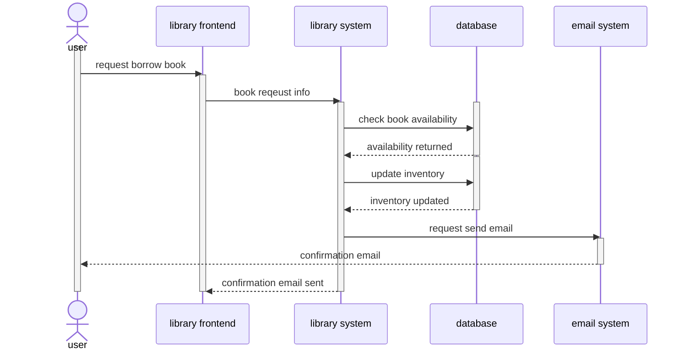

```mermaid
%% Remove the given template below
%% Write your mermaid code here:
sequenceDiagram
    actor user
    participant lf as library frontend
    participant ls as library system
    participant db as database
    participant es as email system

    activate user
    user->>lf: request borrow book

    activate lf
    lf->>ls: book reqeust info

    activate ls

    activate db
    ls->>db: check book availability
    db-->>ls: availability returned
    deactivate db

    activate db
    ls->>db: update inventory
    db-->>ls: inventory updated
    deactivate db


    ls->>es: request send email
    activate es
    es-->>user: confirmation email
    deactivate es
    ls-->>lf: confirmation email sent

    deactivate ls

    deactivate lf
    deactivate user
```
